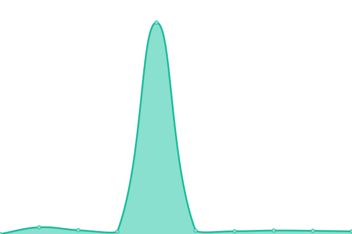
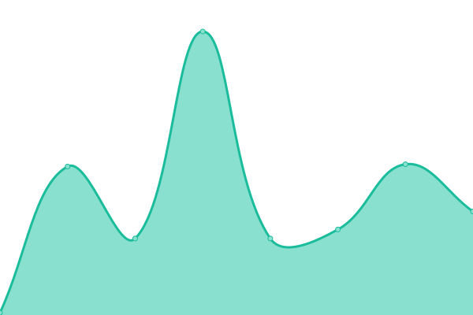
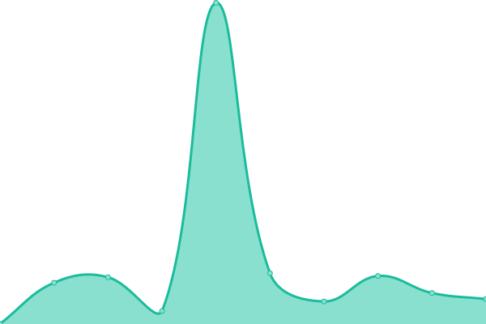

# [📈 Live Status](https://WitherSkell.github.io/pingus): <!--live status--> **🟩 All systems operational**

This repository contains the open-source uptime monitor and status page for [WitherSkell](https://WitherSkell.github.io/pingus), powered by [Upptime](https://github.com/upptime/upptime).

With [Upptime](https://upptime.js.org), you can get your own unlimited and free uptime monitor and status page, powered entirely by a GitHub repository. We use [Issues](https://github.com/WitherSkell/pingus/issues) as incident reports, [Actions](https://github.com/WitherSkell/pingus/actions) as uptime monitors, and [Pages](https://WitherSkell.github.io/pingus) for the status page.

<!--start: status pages-->
<!-- This summary is generated by Upptime (https://github.com/upptime/upptime) -->
<!-- Do not edit this manually, your changes will be overwritten -->
<!-- prettier-ignore -->
| URL | Status | History | Response Time | Uptime |
| --- | ------ | ------- | ------------- | ------ |
|  [Replit (Bot)](https://replit.com/@WitherSkello/Minecraft-247-V2#README.md) | 🟩 Up | [replit-bot.yml](https://github.com/WitherSkell/pingus/commits/HEAD/history/replit-bot.yml) | 

 362ms
     
 | 

<a href="https://WitherSkell.github.io/pingus/history/replit-bot">100.00%</a>
    

|  [Google](https://www.google.com) | 🟩 Up | [google.yml](https://github.com/WitherSkell/pingus/commits/HEAD/history/google.yml) | 

 115ms
     
 | 

<a href="https://WitherSkell.github.io/pingus/history/google">100.00%</a>
    

|  [Replit](https://replit.com) | 🟩 Up | [replit.yml](https://github.com/WitherSkell/pingus/commits/HEAD/history/replit.yml) | 

 46ms
     
 | 

<a href="https://WitherSkell.github.io/pingus/history/replit">100.00%</a>
    

|  [replit me pyage](https://replit.com/@WitherSkello) | 🟩 Up | [replit-me-pyage.yml](https://github.com/WitherSkell/pingus/commits/HEAD/history/replit-me-pyage.yml) | 

 406ms
     
 | 

<a href="https://WitherSkell.github.io/pingus/history/replit-me-pyage">100.00%</a>
    

<!--end: status pages-->

[**Visit our status website →**](https://WitherSkell.github.io/pingus)

## 📄 License

- Powered by: [Upptime](https://github.com/upptime/upptime)
- Code: [MIT](./LICENSE) © [WitherSkell](https://WitherSkell.github.io/pingus)
- Data in the `./history` directory: [Open Database License](https://opendatacommons.org/licenses/odbl/1-0/)
